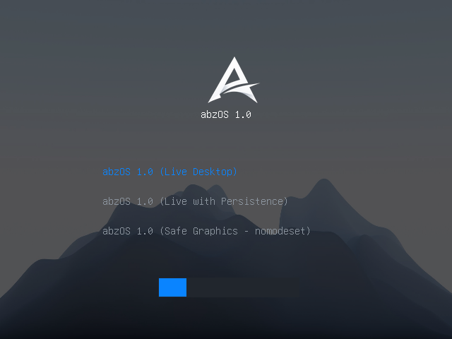
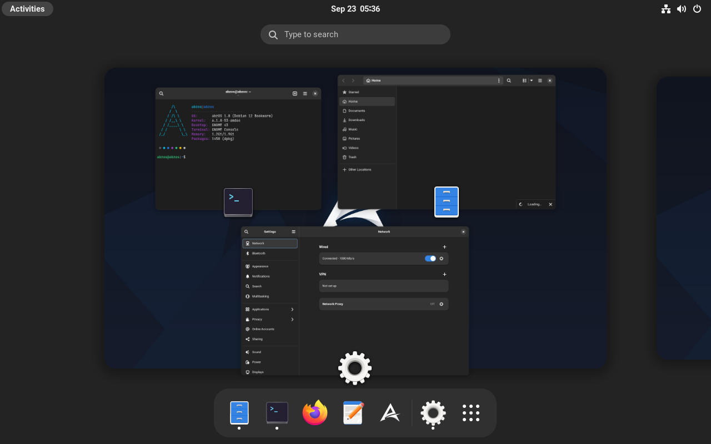
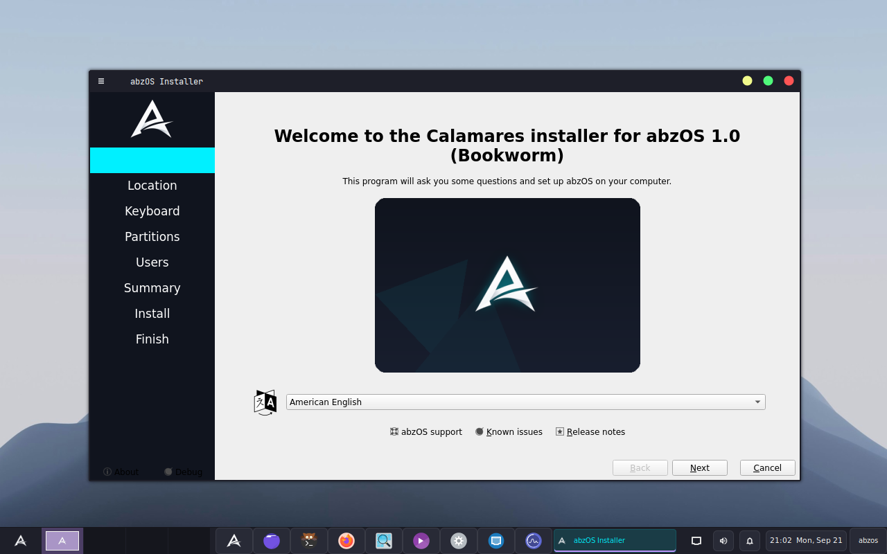

<p align="center">
  
</p>

<h1 align="center">abzOS 1.0</h1>

<p align="center">
  <b>A modern, elegant, and powerful Linux distribution based on Arch Linux with Deepin Desktop Environment (DDE)</b>
</p>

<p align="center">
  
  
  
  
  
</p>

---

## 📌 Overview

**abzOS** is a custom 64-bit Linux distribution engineered for developers, power users, and cybersecurity enthusiasts. Built on top of **Arch Linux** and running the stunning **Deepin Desktop Environment (DDE)**, abzOS combines the bleeding-edge performance of Arch with the refined aesthetics of Deepin, an intuitive graphical installer (**Calamares**), and a pre-configured toolkit for development, penetration testing, and digital forensics.

The operating system is packaged into a bootable hybrid BIOS/UEFI Live ISO: `abzOS-1.0-amd64.iso`.

---

## 📸 Screenshots

| Custom GRUB Bootloader | Live Desktop & Dark Apps |
| :---: | :---: |
|  |  |

| Calamares Graphical Installer |
| :---: |
|  |

---

## ✨ Key Features

### 🖥️ Desktop & Interface
* **Deepin Desktop Environment (DDE)**: Clean, sleek dark-mode desktop with modern animations and integrated dock.
* **Deepin Display Manager (DDM)**: Seamless auto-login into the live desktop session without prompt delays.
* **Optimized KWin Compositor**: Tailored compositor configuration (`kwinrc`) eliminating heavy software effects for snappy performance on both physical machines and virtual environments.
* **PCManFM-Qt File Manager**: Robust and lightweight Qt file manager configured as the default filesystem navigator.
* **Custom Branding & Wallpapers**: High-resolution branded wallpapers and application icon set baked into the environment.

### 💿 Calamares GUI Installer
* Includes an easy-to-use **Calamares graphical installer** accessible right from the desktop.
* Guided partitioning, user setup, timezone selection, and automatic bootloader installation to disk.

### 🛠️ Developer & Cybersecurity Toolkit
* **Core Development**: `base-devel`, `gcc`, `gdb`, `git`, `curl`, `wget`, `jq`, `tree`, `htop`, `python3`, `pip`.
* **Network & Reconnaissance**: `nmap`, `net-tools`, `iputils`, `traceroute`, `whois`.
* **Packet Inspection & Traffic Analysis**: `wireshark-qt`, `wireshark-cli`, `tcpdump`, `socat`, `openbsd-netcat`.
* **Penetration Testing & Security**: `sqlmap`, `john`, `hydra`, `aircrack-ng`, `binwalk`, `hexedit`, `strace`, `ltrace`.

### ⚡ Hardware Support & Virtualization
* **Graphics & Display**: Open-source drivers for Intel, AMD, and NVIDIA Nouveau (`xf86-video-amdgpu`, `xf86-video-ati`, `xf86-video-nouveau`, `xf86-video-vesa`), Mesa 3D with Vulkan acceleration and VA-API hardware decoding.
* **Dynamic Resolution Detection**: `abzos-display-setup` automatically adapts the display resolution to native screen geometry.
* **Virtual Machine Guest Integration**:
  * **QEMU / KVM**: `spice-vdagent` for seamless clipboard sharing and dynamic auto-resizing; `qemu-guest-agent`.
  * **VMware**: `open-vm-tools` guest integration.
* **Modern Audio**: `pipewire`, `pipewire-pulse`, `pipewire-alsa`, and `wireplumber` with `pavucontrol`.
* **Networking & Filesystems**: `networkmanager`, full Wi-Fi firmware suite (`linux-firmware`), Bluetooth (`bluez`), and support for NTFS, exFAT, EXT4, FAT32 (`dosfstools`, `ntfs-3g`, `exfatprogs`).

---

## 🔑 Default Credentials

| Account | Username | Password | Privileges |
| :--- | :--- | :--- | :--- |
| **Live User** | `abzos` | `abzos` | Passwordless `sudo` enabled (Autologin) |
| **Root User** | `root` | `toor` | Superuser |

---

## 📂 Repository Layout

```text
├── .gitignore                   # Excludes multi-GB build outputs and cache
├── README.md                    # Project documentation
├── scripts/
│   ├── Dockerfile               # Rootfs recipe: packages, drivers, branding & configs
│   ├── build_iso.sh             # Main ISO build orchestrator
│   ├── stream_squashfs.py       # High-performance live filesystem compressor
│   ├── test_iso.sh              # Interactive QEMU launcher with GPU & SPICE
│   ├── verify_iso_boot.py       # Automated headless QEMU boot test & screenshot capture
│   ├── generate_wallpapers.py   # Procedural wallpaper and asset generator
│   ├── assets/                  # Calamares installer configuration & branding
│   └── grub-theme/              # Custom abzOS GRUB bootloader theme
├── calamares_verify.png         # Calamares installer verification screenshot
├── dark_apps_verify.png         # Desktop verification screenshot
└── grub_verify.png              # GRUB bootloader screenshot
```

---

## 🚀 Building from Source

### Prerequisites
* Linux host (Ubuntu, Debian, Fedora, Arch, etc.)
* **Docker** installed and running
* Standard utilities: `bash`, `python3`

### Build Command
To build the complete ISO from scratch, simply run:

```bash
./scripts/build_iso.sh
```

**The build pipeline will automatically:**
1. Build the Arch Linux container image using `scripts/Dockerfile`.
2. Extract the kernel (`vmlinuz-linux`) and initramfs (`initramfs-linux.img`).
3. Stream the container filesystem into a compressed SquashFS live image.
4. Setup the custom abzOS GRUB theme and boot configuration.
5. Generate the hybrid bootable ISO: `abzOS-1.0-amd64.iso` in the project root.

---

## 🧪 Testing in Virtual Machines

### Interactive Test (QEMU with GPU acceleration)
```bash
./scripts/test_iso.sh
```
*Launches QEMU with 6GB RAM, 4 CPU cores, VirtIO GPU, and SPICE auto-resizing.*

### Automated Headless Verification
```bash
python3 scripts/verify_iso_boot.py
```
*Boots the ISO in a headless QEMU instance, verifies serial console output and systemd services, and generates a screenshot of the graphical session.*

---

## 💾 Flashing to USB Drive

To create a bootable USB drive, replace `/dev/sdX` with your target USB flash drive:

```bash
sudo dd if=abzOS-1.0-amd64.iso of=/dev/sdX bs=4M status=progress oflag=sync
```
*(Or use graphical tools like **Balena Etcher** or **Rufus** in DD mode).*

---

## 👤 Author
Developed by **[Akbarkhojayev](https://github.com/akbarkhojayev)**
